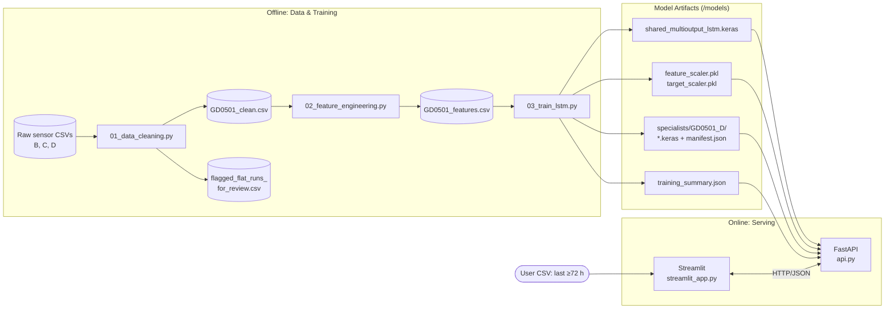
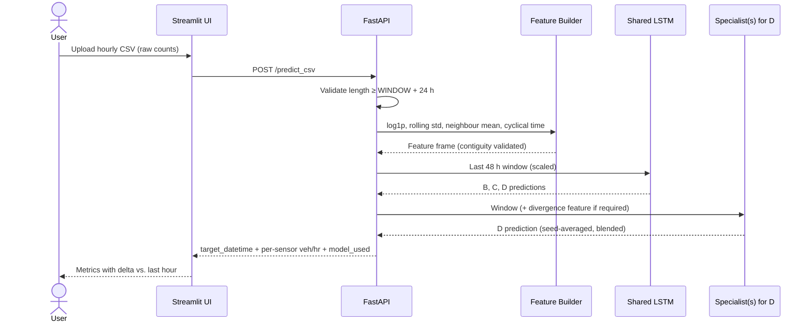
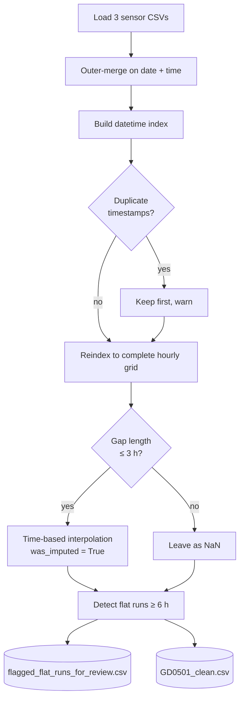
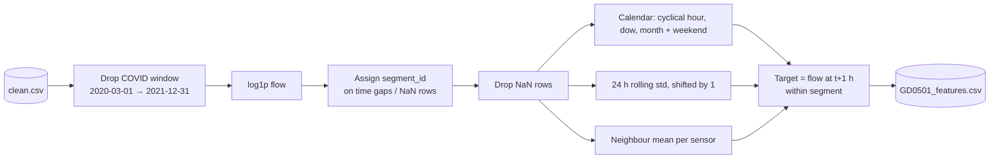
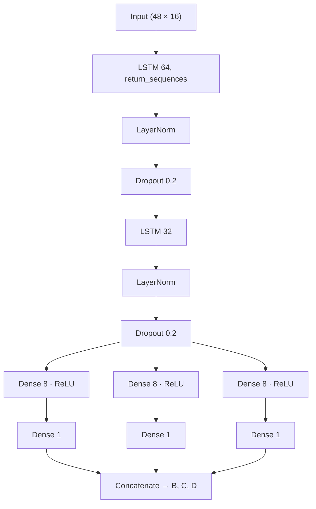
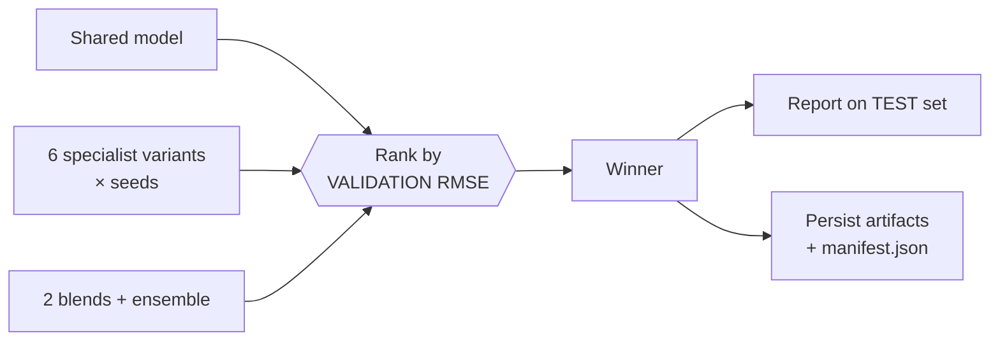

# 🚦 Urban Traffic Flow Prediction — GD0501 Sensors

> Production-style, 1-hour-ahead vehicle flow forecasting for three urban traffic sensors (`GD0501_B`, `GD0501_C`, `GD0501_D`) using LSTM networks, validation-driven model selection, a FastAPI inference service and a Streamlit dashboard.


---

## Table of Contents

1. [Overview](#1-overview)
2. [System Architecture](#2-system-architecture)
3. [Repository Structure](#3-repository-structure)
4. [Data Pipeline](#4-data-pipeline)
5. [Feature Engineering](#5-feature-engineering)
6. [Modeling](#6-modeling)
7. [Evaluation Methodology](#7-evaluation-methodology)
8. [Serving: FAST API](#8-serving-fast-api)
9. [Web App](#9-web-app)
10. [Quickstart](#10-quickstart)
11. [Configuration Reference](#11-configuration-reference)
12. [Design Decisions & Rationale](#12-design-decisions--rationale)
13. [Limitations & Future Work](#13-limitations--future-work)

---

## 1. Overview

Short-horizon traffic forecasting supports signal timing, congestion alerts and routing. This project predicts the **vehicle count per hour, one hour ahead**, for three neighbouring sensors on the GD0501 corridor.

**Highlights**

- **Leakage-aware pipeline** — chronological splits, scalers fit on train only, targets verified against raw data by an automated alignment check.
- **Gap-aware sequencing** — data is split into contiguous *segments*; no training window ever spans a sensor outage.
- **Multi-output LSTM** with per-sensor heads, plus **dedicated specialist models** for the hardest sensor (`GD0501_D`).
- **Validation-only model selection** among 7 candidates (shared model, 6 specialist variants, blends, ensemble). The test set is never used to choose.
- **Strong baselines** (persistence, seasonal-naive, profile-adjusted persistence, Ridge) so the LSTM must justify its complexity.
- **Deployable** — FastAPI service reproduces the exact training-time feature pipeline; Streamlit front-end for non-technical users.

---

## 2. System Architecture



### Request lifecycle (inference)



---

## 3. Repository Structure

> Scripts reference `../dataset` and `../models`, so they are intended to live in a subfolder (e.g. `src/`). Adjust paths to taste.

```
traffic-flow-forecasting/
├── dataset/
│   ├── raw/flows/               # GD0501_B.csv, GD0501_C.csv, GD0501_D.csv
│   └── processed/               # generated: clean, features, flagged runs
├── models/                      # generated artifacts
│   ├── shared_multioutput_lstm.keras
│   ├── feature_scaler.pkl
│   ├── target_scaler.pkl
│   ├── training_summary.json
│   └── specialists/GD0501_D/    # winning specialist seeds + manifest.json
├── src/
│   ├── 01_data_cleaning.py
│   ├── 02_feature_engineering.py
│   └── 03_train_lstm.py
├── api.py                       # FastAPI inference service
├── streamlit_app.py             # Web UI
└── README.md
```

---

## 4. Data Pipeline

**Script:** `01_data_cleaning.py`

Inputs are hourly flow CSVs (`date`, `time`, `flow`) per sensor.



| Step | Rule | Why |
|---|---|---|
| Hourly reindex | Full `date_range` at `freq="h"` | Makes missing hours explicit instead of silently absent |
| Short-gap imputation | Interpolate only gaps ≤ `MAX_INTERPOLATE_HOURS = 3` | Traffic is smooth over a few hours; longer gaps would fabricate patterns |
| Long gaps | Left as `NaN` | Handled downstream by segmentation, not by guessing |
| Stuck-sensor detection | Runs of identical values ≥ `FLAT_RUN_FLAG_HOURS = 6` exported for **manual review** | Flat lines are a classic sensor-fault signature; flagged, not auto-deleted |
| Audit column | `was_imputed` | Preserves provenance of every filled value |

---

## 5. Feature Engineering

**Script:** `02_feature_engineering.py`



### Feature set (16 inputs per timestep)

| Group | Count | Description |
|---|---|---|
| Flow (log1p) | 3 | Current flow of B, C, D |
| Rolling volatility | 3 | 24 h rolling std, `shift(1)` so the current hour is excluded |
| Spatial context | 3 | Mean log-flow of the *other two* sensors |
| Cyclical time | 6 | sin/cos of hour-of-day, day-of-week, month |
| Weekend flag | 1 | `day_of_week ≥ 5` |

**Targets:** `<sensor>_target` = log-flow at `t + HORIZON` (default 1 h), computed **inside each segment** so no target crosses an outage.

> **Regime handling:** the COVID period is excluded by default (`EXCLUDE_COVID_PERIOD = True`) because mobility patterns in that window are non-representative of normal operation.

---

## 6. Modeling

**Script:** `03_train_lstm.py`

### 6.1 Data split & sequences

- **Chronological** split: 70 % train / 15 % val / 15 % test (no shuffling).
- `StandardScaler` for features and targets **fit on train only**.
- Sliding windows of `WINDOW = 48` hours; a window is kept only if it lies within a single segment *and* spans exactly 47 hours of wall-clock time.
- A built-in `check_target_alignment` guard raises an error if `*_target` is not truly `HORIZON` hours ahead.

### 6.2 Shared multi-output LSTM



Optimiser: Adam (1e-3) · Loss: MSE · `EarlyStopping(patience=10, restore_best_weights)` · `ReduceLROnPlateau(factor=0.5, patience=5)`.

### 6.3 Specialist models for `GD0501_D`

`GD0501_D` is the hardest sensor to forecast, so it gets a dedicated search over six variants, each trained with multiple seeds (3 for most) and averaged.

| Variant | Sample weighting | Huber loss | Residual target | Divergence feature |
|---|:-:|:-:|:-:|:-:|
| `specialist` | ✗ | ✗ | ✗ | ✗ |
| `weighted` | ✓ | ✗ | ✗ | ✗ |
| `weighted-huber` | ✓ | ✓ | ✗ | ✗ |
| `residual-huber` | ✓ | ✓ | ✓ | ✗ |
| `weighted-huber-div` | ✓ | ✓ | ✗ | ✓ |
| `residual-huber-div` | ✓ | ✓ | ✓ | ✓ |

- **Sample weighting** — weights proportional to true flow so errors at busy hours count more.
- **Huber loss** — robust to outlier hours / possible sensor glitches.
- **Residual target** — predicts the *change* in log-flow from the latest hour rather than the absolute level (a strong persistence prior).
- **Divergence feature** — std-dev of the two neighbouring sensors, a signal for when D is likely to behave differently.

Composite candidates are also scored: `blend-huber`, `blend-huber-div`, and an `ensemble` average of all members.

### 6.4 Model selection (validation only)



The winner's seed models, weights and normalisation statistics (`residual_stats`, `divergence_stats`) are written to `models/specialists/<sensor>/manifest.json`, which the API reads at start-up. If the shared model wins, no extra artifact is saved.

---

## 7. Evaluation Methodology

All metrics are computed in **vehicles/hour** (predictions are inverse-transformed: scaler → `expm1` → clipped at 0).

| Metric | Purpose |
|---|---|
| MAE | Average absolute error, interpretable in vehicles/hr |
| RMSE | Penalises large misses |
| R² | Variance explained |
| WAPE | Scale-free error % (`Σ|err| / Σ y`) — comparable across sensors |

### Baselines the LSTM must beat

| Baseline | Idea |
|---|---|
| Persistence | Next hour = latest hour |
| Seasonal-naive (24 h) | Same hour yesterday |
| Profile-adjusted persistence | Latest hour + typical hour-of-week change (median profile from train) |
| Ridge regression | Linear model on the same flattened windows (α chosen on validation) |

The script prints the **LSTM improvement vs. the strongest baseline per sensor** (MAE and RMSE), so claims are always relative to the toughest opponent.

### Diagnostics

- RMSE / std of target, share of squared error from the worst 1 % of windows, count of zero-flow targets.
- **Worst-8 window report for D** — prints actual flow of *all* sensors at the failure hour. If B and C also spiked, it was real traffic; if only D did, suspect the sensor.

### Results

> Results are generated per run into `models/training_summary.json` (per-sensor MAE, RMSE, R², WAPE, winning candidate, and all baselines). Paste your latest numbers here.

| Sensor | Winning model | MAE (veh/hr) | RMSE (veh/hr) | R² | WAPE (%) |
|---|---|---|---|---|---|
| GD0501_B | multi-output | _fill_ | _fill_ | _fill_ | _fill_ |
| GD0501_C | multi-output | _fill_ | _fill_ | _fill_ | _fill_ |
| GD0501_D | _selected on val_ | _fill_ | _fill_ | _fill_ | _fill_ |

---

## 8. Serving: FAST API

**File:** `api.py` (FastAPI)

The service rebuilds the training feature pipeline at inference time (log1p → rolling std → neighbour mean → cyclical time), loads the shared model, scalers and any specialist manifests, and returns the latest forecast.

| Method | Endpoint | Description |
|---|---|---|
| GET | `/health` | Load status, sensors, window, horizon, minimum history required, specialist sensors |
| GET | `/manifest` | Contents of `training_summary.json` |
| POST | `/predict` | Structured payload: `records[{datetime, values{sensor: flow}}]` |
| POST | `/predict_csv` | Flat rows: `[{datetime, GD0501_B, GD0501_C, GD0501_D}, ...]` |

**Input rules**

- Raw vehicle counts (the API applies `log1p` itself).
- Hourly, contiguous, oldest first — gaps or duplicates return HTTP 400.
- At least `WINDOW + 24 = 72` hours (48-hour window plus 24 hours to warm up the rolling std).

**Example**

```bash
curl -X POST http://localhost:8000/predict_csv \
  -H "Content-Type: application/json" \
  -d '[{"datetime":"2024-01-01T00:00:00","GD0501_B":42,"GD0501_C":38,"GD0501_D":51}, ...]'
```

```json
{
  "target_datetime": "2024-01-04T00:00:00",
  "predictions": {
    "GD0501_B": {"predicted_vehicles_per_hour": 41.7, "model_used": "multi-output (shared model)"},
    "GD0501_C": {"predicted_vehicles_per_hour": 37.2, "model_used": "multi-output (shared model)"},
    "GD0501_D": {"predicted_vehicles_per_hour": 49.9, "model_used": "residual-huber"}
  },
  "hours_received": 72,
  "hours_used_in_window": 48
}
```

Model artifact directory is configurable via the `TRAFFIC_MODELS_DIR` environment variable (default `./models`). If loading fails, `/health` reports `status: "error"` and prediction endpoints return 503.

---

## 9. Web App

**File:** `streamlit_app.py`

- Sidebar shows live API health, window/horizon, and which sensors use dedicated models.
- "Show winning model per sensor" pulls `/manifest` and displays test MAE / R².
- Upload a CSV, preview the last 72 hours, and click **Forecast next hour**; each sensor is shown as a metric with its delta vs. the last observed hour.
- Includes a **synthetic template CSV** download to verify the pipeline end-to-end (clearly labelled as non-real data).

---

## 10. Quickstart

```bash
# 1. Environment
python -m venv .venv && source .venv/bin/activate
pip install pandas numpy scikit-learn joblib tensorflow \
            fastapi uvicorn pydantic requests streamlit

# 2. Place raw data in dataset/raw/flows/  (GD0501_B.csv, _C.csv, _D.csv)

# 3. Run the pipeline (from src/)
cd src
python 01_data_cleaning.py
python 02_feature_engineering.py
python 03_train_lstm.py
cd ..

# 4. Serve the model
uvicorn api:app --host 0.0.0.0 --port 8000

# 5. Launch the UI (new terminal)
TRAFFIC_API_URL=http://localhost:8000 streamlit run streamlit_app.py
```

Interactive API docs: `http://localhost:8000/docs`

---

## 11. Configuration Reference

| Parameter | File | Default | Meaning |
|---|---|---|---|
| `MAX_INTERPOLATE_HOURS` | 01 | 3 | Longest gap that is interpolated |
| `FLAT_RUN_FLAG_HOURS` | 01 | 6 | Flat-run length flagged as suspicious |
| `HORIZON` | 02, 03 | 1 | Forecast lead time (hours) — **must match in both** |
| `ROLLING_STD_WINDOW` | 02, api | 24 | Volatility window — **must match in API** |
| `EXCLUDE_COVID_PERIOD` | 02 | True | Drop 2020-03 → 2021-12 |
| `LOG_TRANSFORM_FLOW` | 02 | True | Apply `log1p` to flows |
| `WINDOW` | 03 | 48 | Input sequence length (hours) |
| `VAL_FRAC` / `TEST_FRAC` | 03 | 0.15 / 0.15 | Chronological split sizes |
| `SPECIALIST_SENSORS` | 03 | `["GD0501_D"]` | Sensors that get dedicated model search |
| `SPECIALIST_SEEDS` | 03 | 3 | Seeds per specialist variant |
| `EPOCHS` / `BATCH_SIZE` | 03 | 100 / 64 | Training budget (early stopping applies) |
| `TRAFFIC_MODELS_DIR` | api | `./models` | Artifact location for serving |

---

## 12. Design Decisions & Rationale

| Decision | Rationale |
|---|---|
| Segment IDs instead of dropping/filling long gaps | Preserves honesty of the data; windows never straddle outages |
| `log1p` on flows | Stabilises variance across low-night / high-peak regimes |
| Rolling std uses `shift(1)` | Prevents the current hour leaking into its own feature |
| Scalers fit on train only | Avoids look-ahead leakage into validation/test |
| Selection on **validation** RMSE | Test set remains an unbiased final estimate |
| Multiple seeds per specialist | Reduces variance from random initialisation |
| Residual formulation | Lets the network model *changes*, anchoring on persistence |
| Train/serve parity checks (asserts) | Catches window, horizon, and target misalignment early |
| Manifest-driven loading | API behaviour is determined by the training run, no code edits needed after retraining |

---

## 13. Limitations & Future Work

- **Single horizon** (1 h). Extend with a multi-step decoder or direct multi-horizon heads.
- **Local corridor only.** A graph neural network (e.g. spatio-temporal GCN) could model sensor topology explicitly rather than via neighbour mean.
- **No exogenous signals.** Weather, holidays, incidents and events are not used.
- **Probabilistic output.** Add quantile loss or conformal intervals for uncertainty-aware forecasting.
- **Serving efficiency.** The API reloads nothing per request, but D's ensemble runs many small models sequentially; consider batching or exporting to a single ONNX/TFLite graph.
- **MLOps.** Add experiment tracking (MLflow / W&B), data-drift monitoring, Dockerfile and CI for retraining.
- **Testing.** Unit tests for feature parity between `02_feature_engineering.py` and `api.build_feature_frame`.

---

*Built by Pranav — Computer Engineering, NMIMS MPSTME.*
